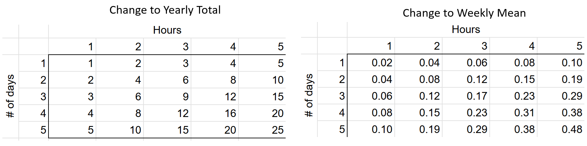
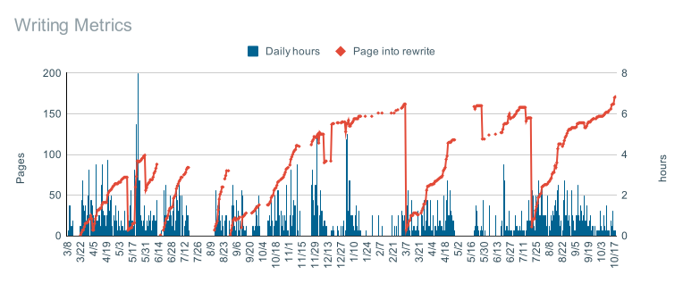
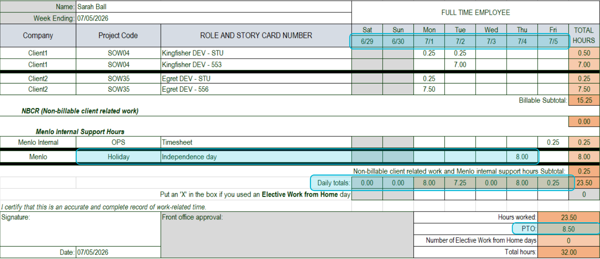
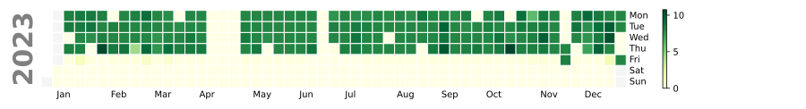

```{r setup, include=FALSE}
knitr::opts_chunk$set(echo = FALSE)
knitr::opts_chunk$set(out.width = "100%")
library(zoo) #TODO: as.Date conflict
install.packages("tidyverse")
library(tidyverse)
library(knitr)
library(kableExtra)

timesheet <- read.csv("data/core_writing_data.csv")
timesheet$date <- as.Date(timesheet$Day, format = "%m/%d/%Y")
# combine entries for the date and category/project.
timesheet <- timesheet %>%
  group_by(date, Day, Time, Category, Project, Sub.Project) %>%
  summarise(Hours = sum(Hours)) %>%
  ungroup()

#todo update new column assignment operators to consistently be <-
#todo R code indentation formatting

#this file is intentionally not included in the repo for privacy reasons
schedule <- read.csv("data/combined_workday_schedule.csv") 
schedule$date <- as.Date(schedule$date, format = "%Y-%m-%d")

#fill in skip days to create a continuous timeseries
timesheet_complete <- timesheet %>%
  filter(!is.na(date)) %>%
  complete(date = seq(min(date), max(date), by = "day"), fill = list(Hours = 0, Time = "N/A", Category = "N/A", Project = "N/A", Sub.Project = ""))

reduct_c = "#9ef0f0"
base_color = "#08bdba"
highlight_c = "#007d79"

```

\<Placeholder for opening graphic - possible weekly hours bar chart?\>

# Summary

With dual degrees in Writing and Computer Science, I have always loved using data to inform my craft. What began as simple word-count tracking of my creative fiction writing, evolved in 2023 into a detailed timesheet that tracked my hours per project—a practice inspired by my software development work at Menlo Innovations.

For this project, I applied my analytical and technical skills to my creative writing process to identify trends or insights present in my historical metrics that I could use to inform my writing habits going forward.

I created visualizations to help contextualize the numbers, enriched my findings with additional data sources to expand the narrative, ran what if scenarios to identify experiments to run, and ultimately created a live dashboard for tracking my progress.

# Quick Links

Looking for examples of how I used specific tools or technologies? Follow these links to jump to the relevant section:

-   [**Spreadsheets**](#spreadsheets) - pivot tables, charts, and formulas

-   [**Python & Data Cleaning**](#python-and-data-cleaning) - python script used to extract, clean, and visualize supplemental schedule data

-   <todo>**R** - this web page was made using R Markdown and most of the plots were made using the ggplot2 library

-   <todo>**Tableau** - I made a live dashboard to track my 2026 goals

# Main Data Structure

My creative writing timesheet is tracked in a Google Sheets and there are five fields:

-   Day - when the writing occurred. There can be multiple entries for the same day logged against different projects (such as August 10th in the example below)

-   Hours - [active writing time](#active-writing-time "Details on what hours I count") tracked in [15 minute increments](#why-15-minutes "Why 15 minutes") or 0.25 of an hour

-   Category - broad [categorization](#category-explanation "What each category means") about the type of writing activity

-   Project - a shortened title of the story

-   Sub Project - an optional field to group specific efforts on a project

{style="border: 2px solid #595959; padding: 5px; border-radius: 4px; display: block; margin: auto;" width="500"}

Prior to this analysis project, my primary way of visualizing this information and benchmarking my progress was through pivot tables and charts in Google Sheets. For details, see [Spreadsheets](#spreadsheets) in the appendix.

# The Goal {#the-goal}

```{r base timeline, fig.height=4, fig.width=12}
timeline <- read.csv("data/timeline_annotated.csv")
timeline$date <- as.Date(timeline$Day, format = "%m/%d/%Y")
timeline_complete <- timeline %>%
  filter(!is.na(date)) %>%
  complete(date = seq(min(date), max(date), by = "day"), fill = list(Hours = 0, Category = "N/A", Project = "N/A", Sub.Project = "", Timeline.category = ""))

  timeline_complete %>%
  # aggregate by month
  mutate(year_month = floor_date(date, "month")) %>%
  group_by(year_month) %>%
  summarise(total_hours = sum(Hours), .groups = "drop") %>%
  # plot
  ggplot(aes(x = year_month, y = total_hours)) +
  geom_col(color = "#ffffff", fill=base_color, show.legend = FALSE) +
  labs(title = "Monthly Total Hours",
       x = "",
       y = "") +
  theme_minimal() +
  scale_x_date(
    date_breaks = "1 month",
    date_labels = "%b %Y",  
    expand = expansion(mult = c(0, 0))
  ) +
  theme(axis.text.x = element_text(angle = 45, hjust = 1))

```

My goal for this project was to identify ways to increase my writing productivity without setting myself an unrealistic or unattainable goal.

Last year, going into 2025, I had set myself the goal of writing at least an hour most days, that is a mode of 1 hour or higher. I thought it was a safe increase to push myself towards given my success in 2024. Surely, my productivity could just keep going up? But in execution, 2025 fell far short of that goal.

TODO: mark mode and median differently

```{r 2024 histogram, fig.height=4, fig.width=12}
y_24_25_date_grouped <- timesheet_complete %>%
  filter(year(date) == 2024 | year(date) == 2025) %>%
  group_by(date) %>%
  summarise(sum_hours = sum(Hours))

y_24_25_date_grouped$year_s <- format(y_24_25_date_grouped$date, "%Y")
y_24_25_date_grouped$highlight <- ifelse(
                  # mark 2024 mode and median
                  (year(y_24_25_date_grouped$date) == 2024 &
                     y_24_25_date_grouped$sum_hours == 0.5) |
                  # mark 2025 mode and median
                    (year(y_24_25_date_grouped$date) == 2025 &
                     y_24_25_date_grouped$sum_hours == 0.25),
                              "Highlighted", "Normal")

median_df <- y_24_25_date_grouped %>%
  group_by(year_s) %>%
  summarise(med_val = median(sum_hours))
median_df$highlight <- "Normal"

facet_labeller <- as_labeller(c(
  "2024" = "2024 - Mode: 0.50 and Median 1.25",
  "2025" = "2025 - Mode: 0.25 and Median 0.50"
))

ggplot(y_24_25_date_grouped, aes(x = sum_hours, fill=highlight)) +
  geom_histogram(
    binwidth = 0.25,
    boundary = 0,
    closed = "left",
    color = "#FFFFFF",
    show.legend = FALSE
    ) +
  geom_vline(data = median_df, aes(xintercept = med_val),
             color = "black", linetype = "dashed", size = 0.5) +
  facet_wrap(~ year_s, labeller = facet_labeller) +
  coord_cartesian(xlim = c(0, 8)) +
  scale_x_continuous(expand = expansion(mult = 0, add = 0)) +
  scale_y_continuous(expand = expansion(add = 0)) +
  scale_fill_manual(values = c("Highlighted" = highlight_c, "Normal" = base_color)) +
  theme_minimal() +
  theme(
    plot.title = element_text(size = 15),
    panel.spacing = unit(2, "lines")
    ) + 
  labs(
    title = "Distribution of writing session length",
    x = "Hours written",
    y = "Number of days"
  ) 

```

# Behind the Data

To better inform why 2025 fell short of that goal, let me unpack and contextualize my high output year.

{style="border: 2px solid #595959; padding: 5px; border-radius: 4px; display: block; margin: auto;" width="680" height="240"}

```{r annotated timeline, fig.height=4, fig.width=12}

custom_colors <- c("9 none" = "#B0B0B0",
"5 Sorceress 2nd" = "#444e86",
"8 1st draft attempt" = "#5886a5",
"7 Raven 1st" = "#955196",
"6 Sorceress 3rd" = "#ff6e54",
"4 Sorceress 4th - R & R" = "#faa600",
"3 Raven 2nd" = "#dd5182",
"2 Sorceress 5th" = "#01976C",
"1 Katarin 1st" = "#97014B",
"0 Katarin 2nd" = "#015697")

  timeline_complete %>%
  # aggregate by month
  mutate(year_month = floor_date(date, "month")) %>%
  group_by(year_month, Timeline.category) %>%
  summarise(total_hours = sum(Hours), .groups = "drop") %>%
  # plot
  ggplot(aes(x = year_month, y = total_hours,  fill=Timeline.category)) +
  geom_col(color = "#ffffff", show.legend = FALSE) +
  scale_fill_manual(values = custom_colors) +
  labs(title = "Monthly Total Hours",
       x = "",
       y = "") +
  theme_minimal() +
  scale_x_date(
    date_breaks = "1 month",
    date_labels = "%b %Y",  
    expand = expansion(mult = c(0, 0))
  ) +
  theme(axis.text.x = element_text(angle = 45, hjust = 1))


```

**2023:**

-   [Jan 2023 - Sorceress 2nd]{style="background-color:#444e86; color:#FFFFFF; padding:5px; border-radius: 10px"} - I finished the 2nd draft of my Sorceress project and sent out queries to literary agents seeking representation.

-   [1st Jul 2023 - draft attempt]{style="background-color:#5886a5; color:#FFFFFF; padding:5px; border-radius: 10px"} - I started writing a brand new story, but lost steam part way in.

-   [Sep 2023 - Raven 1st]{style="background-color:#955196; color:#FFFFFF; padding:5px; border-radius: 10px"} - I decided to participate for the first time in [National Novel Writing Month](https://en.wikipedia.org/wiki/National_Novel_Writing_Month) and used the challenge of 50k words in 30 days to tackle a project I had attempted several times before, but had never finished a full draft. In the months before, I wrote a new outline and the opening chapters. In November, I accomplished the 50k goal, and kept going until the manuscript was finished December 9th for a total of 85k words in 80 days!

-   [Dec 2023 - Sorceress 3rd]{style="background-color:#ff6e54; color:#FFFFFF; padding:5px; border-radius: 10px"} - Fresh off that success, I decided to do another rewrite on my Sorceress manuscript and attempt another round of querying.

**2024:**

-   [Jan - Sorceress 4th - R&R]{style="background-color:#faa600; color:#FFFFFF; padding:5px; border-radius: 10px"} - An agent reached out with interest in the story. She gave me some suggested changes and requested I revise and resubmit. I invested all the free time I had in getting the edits in and resubmitted in under two months. Unfortunately, the agent decided not to sign the project.

-   [Mar - Raven 2nd]{style="background-color:#dd5182; color:#FFFFFF; padding:5px; border-radius: 10px"} - Though disappointed about Sorceress, I was eager to dive back into the Raven manuscript and start the 2nd draft.

-   [Jul - Sorceress 5th]{style="background-color:#01976C; color:#FFFFFF; padding:5px; border-radius: 10px"} - I decided to give the Sorceress project one more revision and round of queries. Receiving only form rejections, I decided to shelve the manuscript.

-   [Oct - Katarin 1st]{style="background-color:#97014B; color:#FFFFFF; padding:5px; border-radius: 10px"} - For my 2nd year participating in NaNoWriMo, I worked on a much shorter project and managed the 50k goal in 23 days!

-   [Dec - Raven 2nd]{style="background-color:#dd5182; color:#FFFFFF; padding:5px; border-radius: 10px"} - I was into the thick of the Raven rewrite. Not the fun and exciting opening chapters, but the messy middle where I needed to address plot gaps, character motivations, and point of view.

**2025:**

-   [Feb, May, and Jun - Pauses]{style="background-color:#dd5182; color:#FFFFFF; padding:5px; border-radius: 10px"} - In order to focus on career certification, a job search, and later adjusting to a new job, I put my daily writing habit on pause.

-   [Jul - Raven 2nd]{style="background-color:#dd5182; color:#FFFFFF; padding:5px; border-radius: 10px"} - I resumed my daily writing habit again, but was still working on tricky parts of the manuscript.

-   [Oct - Katarin 2nd]{style="background-color:#015697; color:#FFFFFF; padding:5px; border-radius: 10px"} - Instead of a NaNoWriMo rough draft, I decided to spend November working on Katarin's 2nd draft, and kept going on it through the end of the year.

**So in summary:**

-   In 2023, I was just getting into the swing of writing on a daily basis and gained momentum through NaNoWriMo going into the next year.

-   In 2024, I worked on highly engaging projects like my Sorceress 4th and 5th drafts, the early stages of my Raven 2nd draft, and a quick rough draft.

-   In 2025, I worked almost exclusively on the harder stages of the Raven 2nd draft with several breaks to accommodate life events in the first half of the year. My hours increased some when I began work on the Katarin 2nd draft.

# Building a Model Year

Given the differences, instead of taking 2024 as-is for my model year, I decided to use it as only a starting point and approximate a better model by correcting for expected differences between 2024 and my anticipated 2026.

## Category Impact

The first high-impact factor was the type of writing I was doing in 2024. It is easier for me to have longer writing sessions when working on 3rd and later drafts. Much of the writing time is spent rereading existing chapters to validate for consistency and continuity. 2nd drafts, by contrast, are high-intensity and I often need frequent breaks. I would compare 3rd+ drafts to a long walk and 2nd drafts to a sprint that is also sometimes uphill.

TODO: standardize how I label median

```{r category histogram 2024, fig.height=3, fig.width=12}

cat_hist <- timesheet_complete

first_median = median(cat_hist$Hours[cat_hist$Category == "1st Draft"], na.rm = TRUE)
second_median = median(cat_hist$Hours[cat_hist$Category == "2nd Draft"], na.rm = TRUE)
third_plus_median = median(cat_hist$Hours[cat_hist$Category == "3rd+ Draft"], na.rm = TRUE)
query_median = median(cat_hist$Hours[cat_hist$Category == "Querying"], na.rm = TRUE)
free_write_median = median(cat_hist$Hours[cat_hist$Category == "Free Write"], na.rm = TRUE)

facet_labeller <- as_labeller(c(
  "1st Draft" = sprintf("1st Draft - Median %.2f", first_median),
  "2nd Draft" = sprintf("2nd Draft - Median %.2f", second_median),
  "3rd+ Draft" = sprintf("3rd+ Draft - Median %.2f",third_plus_median)
))

cat_hist %>%
  filter(Category %in% c("2nd Draft", "3rd+ Draft")) %>%
  ggplot(aes(x = Hours)) +
  geom_histogram(
    binwidth = 0.25,
    boundary = 0,
    closed = "left",
    color = "#FFFFFF",
    fill = base_color,
    show.legend = FALSE,
    position = 'identity',
    aes(y = after_stat(density * width)) #probability percent
    ) +
  labs(
    title = "Normalized distribution of writing session length - 2023 through 2025",
    x = "Hours written",
    y = "Percentage of total"
  ) +
  theme_minimal() +
  facet_wrap(~ Category, labeller = facet_labeller)
```

Because I do not plan to work on a 3rd or later drafts in 2026, I replaced all my 3rd+ writing draft sessions in the model with my median 2nd draft writing session length of 0.75.

I also identified three outlier writing sessions in the query category.

```{r query 2024, fig.height=3, fig.width=12}


cat_hist %>%
  filter(Category %in% c("Querying") & year(date) == 2024) %>%
  ggplot(aes(x = Hours)) +
  geom_histogram(
    binwidth = 0.25,
    boundary = 0,
    closed = "left",
    color = "#FFFFFF",
    fill = base_color,
    show.legend = FALSE,
    position = 'identity',
    ) +
  labs(
    title = "Distribution of querying writing session length - 2024",
    x = "Hours written",
    y = "Count of Days"
  ) +
  theme_minimal()
```

While I usually spend between a quarter and a half hour on querying every few weeks maintaining a list of potential agents for the projects I am working on, it would be unusual for me to spend any longer sessions on the task in 2026 unless I was working on querying material for a specific project. Since I do not plan to have a manuscript reaching that level of completion in 2026, I also replaced these writing sessions with my 2nd draft median.

```{r category corrected, fig.height=3, fig.width=12}

model_year <- timesheet_complete %>%
  filter(year(date) == 2024)

# collect totals of incremental adjustments
model_adjustments <- data.frame(type = c("2024 Original"),
                                yearly_total = c(sum(model_year$Hours, na.rm=TRUE)))

# 3rd draft adjustment
model_year$cat_adjust_hours = ifelse(model_year$Category == "3rd+ Draft", 
                                             0.75, model_year$Hours)

model_adjustments <- rbind(model_adjustments, data.frame(
  type ="3rd+ draft replaced",
  yearly_total = sum(model_year$cat_adjust_hours, na.rm=TRUE)
))

# Query adjustment
model_year$cat_adjust_hours = ifelse(model_year$Category == "Querying" 
                                     & model_year$Hours > 2, 
                                             0.75, model_year$cat_adjust_hours)

model_adjustments <- rbind(model_adjustments, data.frame(
  type ="Querying replaced",
  yearly_total = sum(model_year$cat_adjust_hours, na.rm=TRUE)
))

#diff for plotting stacked
model_year$cat_adjust_diff = model_year$Hours - model_year$cat_adjust_hours

model_year %>%
  pivot_longer(
    cols = c(cat_adjust_hours, cat_adjust_diff),
    names_to = "hour_set",
    values_to = "split_hours"
  ) %>%
  # aggregate by month
  mutate(month = floor_date(date, "month")) %>%
  group_by(month, hour_set) %>%
  summarise(
    total_hours = sum(split_hours), 
    .groups = "drop") %>%
  # plot
  ggplot(aes(x = month, y = total_hours, fill = hour_set)) +
  geom_col(color = "#ffffff"
           ) +
  scale_fill_manual(
    values = c("cat_adjust_hours" = base_color, "cat_adjust_diff" = reduct_c),
    labels = c("cat_adjust_hours" = "Updated model", "cat_adjust_diff" = "Reduction")
    ) +
  labs(title = "Monthly Total Hours",
       x = "",
       y = "") +
  theme_minimal() +
  scale_x_date(
    date_breaks = "1 month",
    date_labels = "%b %Y",  
    expand = expansion(mult = c(0, 0))
  )

```

## Schedule Changes

Another complicating factor to my data set was my work schedule. In 2024, I was working a 4 day a week schedule at Menlo Innovations. In April 2025, I switched to a 5 day schedule at Quantum Signal AI. To adjust my model year, I wanted to calculate my median weekday versus weekend writing session length, while also considering outliers in the data.

```{r daily_scatter, fig.height=3, fig.width=12}

# group by day - across categories
model_year_daily <- model_year %>%
  group_by(date = floor_date(date, unit ="day")) %>%
  summarise(
    total_original_hours = sum(Hours),
    cat_adjust_hours = sum(cat_adjust_hours),
    .groups = 'drop') %>%
  mutate(
    day_of_week = weekdays(date),
    # Calculate days to add to reach Sunday - weekday 0
    # If the current day is Sunday (0), add 0 days. If Saturday (6), add 1 day, etc.
    week_ending = date + (7 - as.numeric(format(date, "%w"))) %% 7,
  )
  

model_year_daily %>%
  ggplot(aes(x = date, y = total_original_hours)) +
  geom_point(color = base_color) +
  labs(title = "Daily writing session length - 2024 actuals",
       x = "",
       y = "Hours") +
  theme_minimal() +
  scale_x_date(
    date_breaks = "1 month",
    date_labels = "%b %Y",  
    expand = expansion(mult = c(0, 0))
  )

```

As you can see in the above, my writing hours are highly variable from day-to-day. I knew that the spike up to 8 hours in June 2024 occurred during a vacation week focused almost exclusively on creative writing, but I did not know how many other high or low writing days were on vacation or sick days.

To determine this I enriched my data set with information about my work schedule. For more on how I sourced and cleaned my schedule data from my old Menlo timesheets, see [**Python & Data Cleaning**](#python-and-data-cleaning).

This data enrichment helped me confirm that paid leave days in general--both sick days and vacation days--included highly variable data. With these days excluded I could calculate my median weekend and weekday writing speed.

```{r schedule histogram 2024, fig.height=3, fig.width=12}

# Added granularity ultimately no needed - consolidated PTO types
schedule <- schedule %>% 
  mutate(schedule_type = case_when(
    schedule_category == "holiday" ~ "paid leave",
    schedule_category == "sickday" ~ "paid leave",
    schedule_category == "vacation" ~ "paid leave",
    schedule_category == "weekend" ~ "weekend",
    schedule_category == "workday" ~ "workday",
  ))

merged <- left_join(model_year_daily, schedule, by ="date")

pto_median = median(merged$total_original_hours[merged$schedule_type == "paid leave"], na.rm = TRUE)
weekend_median = median(merged$total_original_hours[merged$schedule_type == "workday"], na.rm = TRUE)
weekday_median = median(merged$total_original_hours[merged$schedule_type == "weekend"], na.rm = TRUE)


facet_labeller <- as_labeller(c(
  "paid leave" = sprintf("Paid Leave - Median %.2f", pto_median),
  "workday" = sprintf("Workday - Median %.2f", weekday_median),
  "weekend" = sprintf("Weekend - Median %.2f", weekend_median)
))

merged %>%
  ggplot(aes(x = total_original_hours)) +
  geom_histogram(
    binwidth = 0.25,
    boundary = 0,
    closed = "left",
    color = "#FFFFFF",
    fill = base_color,
    show.legend = FALSE,
    position = 'identity',
    aes(y = after_stat(density * width)) #probability percent
    ) +
  facet_wrap(~ schedule_type, labeller = facet_labeller) +
  labs(
    title = "Distribution of writing session length - 2024 actuals",
    x = "Hours written",
    y = "Percentage of total"
  ) +
  theme_minimal()
```

Because my weekend habit is usually to spend one day heavily focused on chores and life admin tasks, my weekend writing productivity usually varies from day-to-day. So instead of just replacing all Fridays or all Sundays, I selected the highest of the three to replace with my workday median of 1.25 if it was greater than the median.

```{r schedule corrected, fig.height=3, fig.width=12}
# pivot out for week-wise logic
temp <- model_year_daily %>% 
  pivot_wider(
    id_cols = week_ending,
    names_from = day_of_week, 
    values_from = cat_adjust_hours) %>% 
  mutate(day_to_adjust = case_when (
     Friday > 1.25 
     & Friday >= Saturday 
     & Friday >= Sunday ~ "Friday",
     Saturday > 1.25 
     & Saturday >= Friday 
     & Saturday >= Sunday ~ "Saturday",
     Sunday > 1.25
     & Sunday >= Friday 
     & Sunday >= Saturday ~ "Sunday",
     TRUE ~ "None"
))

# overwrite with adjusted values
temp$Friday <- ifelse(temp$day_to_adjust == "Friday", 1.25, temp$Friday)
temp$Saturday <- ifelse(temp$day_to_adjust == "Saturday", 1.25, temp$Saturday)
temp$Sunday <- ifelse(temp$day_to_adjust == "Sunday", 1.25, temp$Sunday)

# pivot back to tall
temp <- temp %>%
  pivot_longer(
    cols =  c("Monday", "Tuesday", 
              "Wednesday", "Thursday" , 
              "Friday" , "Saturday" , "Sunday"),
    names_to = "day_of_week",
    values_to = "sched_adjusted_hours"
  )

#calculate dates
days_from_sun <- c("Monday"=6, "Tuesday"=5, "Wednesday"=4, "Thursday"=3, 
             "Friday"=2, "Saturday"=1, "Sunday"=0)
temp$date <- temp$week_ending - days_from_sun[temp$day_of_week]

model_year_daily_merged <- merge(model_year_daily, temp[, c("date", "sched_adjusted_hours")], by = "date")

model_adjustments <- rbind(model_adjustments, data.frame(
  type ="Weekend shortened",
  yearly_total = sum(model_year_daily_merged$sched_adjusted_hours, na.rm=TRUE)
))

# diff for stack plotting
model_year_daily_merged$sched_adjust_diff = model_year_daily_merged$cat_adjust_hours - 
                                    model_year_daily_merged$sched_adjusted_hours

model_year_daily_merged %>%
  pivot_longer(
    cols = c(sched_adjusted_hours, sched_adjust_diff),
    names_to = "hour_set",
    values_to = "split_hours"
  ) %>%
  mutate(month = floor_date(date, "month")) %>%
  group_by(month, hour_set) %>%
  summarise(
    total_hours = sum(split_hours),
    .groups = "drop") %>%
  ggplot(aes(x = month, y = total_hours, fill = hour_set)) +
  geom_col(color = "#ffffff") +
  scale_fill_manual(
    values = c("sched_adjust_diff" = reduct_c, "sched_adjusted_hours" = base_color),
    labels = c("sched_adjusted_hours" = "Adjusted Hours", "sched_adjust_diff" = "Reduction")
    ) +
  labs(title = "Monthly Total Hours",
       x = "",
       y = "") +
  theme_minimal() + 
  scale_x_date(
    date_breaks = "1 month",
    date_labels = "%b %Y",  
    expand = expansion(mult = c(0, 0))
  )

 
```

## Model Year Review

With both sets of adjustments in place, you can see the resulting adjustments between 2024 and my model year.

TODO: crop x scale short of 2025 - styling

```{r model year review, fig.height=3, fig.width=12}

model_year_monthly <- model_year_daily_merged %>%
  mutate(month = floor_date(date, "month")) %>%
  group_by(month) %>%
  summarise(
    orig_hours = sum(total_original_hours), 
    post_adj_hours = sum(sched_adjusted_hours), 
    .groups = "drop")

facet_labeller <- as_labeller(c(
  "orig_hours" = "2024 actuals",
  "post_adj_hours" = "Modified model year"
))

model_year_monthly %>%
  pivot_longer(
    cols = c(orig_hours, post_adj_hours),
    names_to = "hour_set",
    values_to = "split_hours"
  ) %>%
  # plot
  ggplot(aes(x = month, y = split_hours)) +
  geom_col(color = "#ffffff",
           fill = base_color
           ) +
  facet_wrap(~ hour_set, labeller = facet_labeller) +
  labs(title = "Total hours per month",
       x = "",
       y = "") +
  theme_minimal() 

model_adjustments$weekly_mean <- model_adjustments$yearly_total / 366 * 7 #2024 was a leap year

```

I also broke down numerically the results of each modification.

|   | 2024 | 3rd Draft reduction | Querying reduction | Schedule reduction | New Model |
|:-----------|:-----------|:-----------|:-----------|------------|------------|
| **Yearly total** | 554.25 | -102.5 | -11 | -45.25 | 395.5 |
| **Weekly mean** | 10.60 | -1.96 | -0.21 | -0.87 | 7.56 |

While I have primarily displayed my data on a monthly cadence up to this point, for the purposes of planning my goal, I am more interested in the more granular weekly measure, so I calculated the weekly mean based on the yearly total for each.

# What ifs

To identify experiments I could run to hit my model year goal, I ran what if scenarios against my lower productivity 2025 data set to see which adjustments might have allowed me to hit my model year output.

```{r 2025 daily baseline, fig.height=3, fig.width=12}

y_25_daily <- timesheet_complete %>%
  filter(year(date) == 2025) %>%
  group_by(date) %>%
  summarise(
    total_orig_hours = sum(Hours), 
    .groups = "drop") %>%
  mutate(
    # Calculate days to add to reach Sunday - weekday 0
    # If the current day is Sunday (0), add 0 days. If Saturday (6), add 1 day, etc.
    week_ending = date + (7 - as.numeric(format(date, "%w"))) %% 7
  )

what_if_adjustments <- data.frame(type = c("Starting point"),
                                yearly_total = c(sum(y_25_daily$total_orig_hours, na.rm=TRUE)))

```

TODO: legend labels for all

## 1) No Skip Days 

What if I had maintained my writing streak and written my minimum of 0.25 everyday. In 2025, I skipped writing 57 days - the bulk of them during the pause periods noted previously.

```{r Skip Days, fig.height=3, fig.width=12}

y_25_daily$skip_adjust_hours = ifelse(y_25_daily$total_orig_hours == 0, 
                                             0.25, y_25_daily$total_orig_hours)


what_if_adjustments <- rbind(what_if_adjustments, 
                             data.frame(
                               type ="No Skips",
                               yearly_total = sum(y_25_daily$skip_adjust_hours, na.rm=TRUE)
                            ))

y_25_daily$skip_adjust_change = y_25_daily$skip_adjust_hours - y_25_daily$total_orig_hours 

y_25_daily %>%
  pivot_longer(
      cols = c(skip_adjust_hours, skip_adjust_change),
      names_to = "hour_set",
      values_to = "split_hours"
  ) %>%
  mutate(month = floor_date(date, "month")) %>%
  group_by(month, hour_set) %>%
    summarise(
      total_hours = sum(split_hours),
      .groups = "drop") %>%
  ggplot(aes(x = month, y = total_hours, fill = hour_set)) +
  geom_col(color = "#ffffff"
           ) +
  scale_fill_manual(
    values = c("skip_adjust_change" = highlight_c, "skip_adjust_hours" = base_color),
    labels = c("Increase", "2025 Basline")
    ) +
  labs(title = "No Skip Days",
       x = "",
       y = "") +
  theme_minimal() + 
  scale_x_date(
    date_breaks = "1 month",
    date_labels = "%b %Y",  
    expand = expansion(mult = c(0, 0))
  )

```

## 2) Raised Minimum 

What if I had maintained my daily writing streak and also raised my minimum to at least 0.5 hours every day?

```{r Half Hour Min, fig.height=3, fig.width=12}

y_25_daily$min_adjust_hours = ifelse(y_25_daily$total_orig_hours < 0.5, 
                                             0.5, y_25_daily$total_orig_hours)

what_if_adjustments <- rbind(what_if_adjustments,
                             data.frame(
                               type ="Raised Minimum",
                               yearly_total = sum(y_25_daily$min_adjust_hours, na.rm=TRUE)
                            ))

y_25_daily$min_adjust_change = y_25_daily$min_adjust_hours - y_25_daily$total_orig_hours 

y_25_daily %>%
  pivot_longer(
      cols = c(min_adjust_hours, min_adjust_change),
      names_to = "hour_set",
      values_to = "split_hours"
  ) %>%
  mutate(month = floor_date(date, "month")) %>%
  group_by(month, hour_set) %>%
    summarise(
      total_hours = sum(split_hours),
      .groups = "drop") %>%
  ggplot(aes(x = month, y = total_hours, fill = hour_set)) +
  geom_col(color = "#ffffff"
           ) +
  scale_fill_manual(
    values = c("min_adjust_change" = highlight_c, "min_adjust_hours" = base_color),
    labels = c("Increase", "2025 Basline")
    ) +
  labs(title = "Half Hour Minimum",
       x = "",
       y = "") +
  theme_minimal() + 
  scale_x_date(
    date_breaks = "1 month",
    date_labels = "%b %Y",  
    expand = expansion(mult = c(0, 0))
  )

```

## 3) Two Writing Days 

What if I wrote at least 1.5 hours on at least two days a week?

Currently, I often hit that threshold on Wednesdays when I attend a weekly writing meetup. What if I had a second day set aside to extra writing time? To approximate this, I took all weeks that did not already have at least 2 days meeting the criteria, and updated either Wednesday, Saturday, or both days to meet the 2 day requirement.

```{r Twice Weekly, fig.height=3, fig.width=12}
#  note partial weeks at start and end of year already met criteria so no 
#  special casing was needed to prevent adding hours for a day in 2024 or 2026

twice <- y_25_daily %>% 
  mutate(
    day_of_week = weekdays(date),
    # Calculate days to add to reach Sunday - weekday 0
    # If the current day is Sunday (0), add 0 days. If Saturday (6), add 1 day, etc.
    week_ending = date + (7 - as.numeric(format(date, "%w"))) %% 7
  ) %>%
  pivot_wider(
    id_cols = week_ending,
    names_from = day_of_week, 
    values_from = total_orig_hours)

threshold <- 1.5

twice$weekly_count <- apply(twice[, c("Monday", "Tuesday", 
                                      "Wednesday", "Thursday" , 
                                      "Friday" , "Saturday" , "Sunday")],
                            1, function(row) sum(row >= threshold, na.rm = TRUE))
twice$adjust <- ifelse(twice$weekly_count < 2, TRUE, FALSE)

#assign Wednesdays
twice$Wednesday <- ifelse(twice$adjust & twice$Wednesday <= threshold, threshold, twice$Wednesday)

#reassess remaining
twice$weekly_count <- apply(twice[, c("Monday", "Tuesday", 
                                      "Wednesday", "Thursday" , 
                                      "Friday" , "Saturday" , "Sunday")],
                            1, function(row) sum(row >= threshold, na.rm = TRUE))
twice$adjust <- ifelse(twice$weekly_count < 2, TRUE, FALSE)
#assign Saturdays
twice$Saturday <- ifelse(twice$adjust & twice$Saturday <= threshold, threshold, twice$Saturday)

#pivot back to tall
twice <- twice %>%
  pivot_longer(
    cols =  c("Monday", "Tuesday", 
              "Wednesday", "Thursday" , 
              "Friday" , "Saturday" , "Sunday"),
    names_to = "day_of_week",
    values_to = "twice_adjusted_hours"
  )

days_from_sun <- c("Monday"=6, "Tuesday"=5, "Wednesday"=4, "Thursday"=3, 
             "Friday"=2, "Saturday"=1, "Sunday"=0)
twice$date <- twice$week_ending - days_from_sun[twice$day_of_week]

y_25_daily_with_twice <- merge(y_25_daily, twice[, c("date", "twice_adjusted_hours")], by = "date")

what_if_adjustments <- rbind(what_if_adjustments, 
                             data.frame(
                               type ="Two Writing Days",
                               yearly_total = sum(y_25_daily_with_twice$twice_adjusted_hours, na.rm=TRUE)
                            ))

y_25_daily_with_twice$twice_adjust_change <- y_25_daily_with_twice$twice_adjusted_hours - y_25_daily_with_twice$total_orig_hours 


y_25_daily_with_twice %>%
  pivot_longer(
      cols = c(twice_adjusted_hours, twice_adjust_change),
      names_to = "hour_set",
      values_to = "split_hours"
  ) %>%
  mutate(month = floor_date(date, "month")) %>%
  group_by(month, hour_set) %>%
    summarise(
      total_hours = sum(split_hours),
      .groups = "drop") %>%
  ggplot(aes(x = month, y = total_hours, fill = hour_set)) +
  geom_col(color = "#ffffff"
           ) +
  scale_fill_manual(
    values = c("twice_adjust_change" = highlight_c, "twice_adjusted_hours" = base_color),
  labels = c("Increase", "2025 Basline")
    ) +
  labs(title = "Two Writing Days",
       x = "",
       y = "") +
  theme_minimal() + 
  scale_x_date(
    date_breaks = "1 month",
    date_labels = "%b %Y",  
    expand = expansion(mult = c(0, 0))
  )

```

## 4) Writing Vacations 

What if I took time off from work with the express purpose of spending a large portion of that day writing?

For this one, I did not create a chart, but rather tables to assessed the potential impact.

Given `n` number of writing vacations days and `h` additional hours worked on those days The total yearly increase would be `h * n` And the weekly mean change as a result would be `h * n / 365 * 7`

The resulting tables:



## The results

```{r Calc weekly}

what_if_adjustments$weekly_mean <- what_if_adjustments$yearly_total / 365 * 7

```

|   | Model | 2025 start | No Skips | Raised Minimum, No Skips | Two writing days | Vacation |
|:----------|-----------|:----------|:----------|:----------|-----------|-----------|
| **Yearly total** | 395.5 | 288.25 | +14.25 | +49.25 | +53.5 | +1 to 25 |
| **Weekly mean** | 7.56 | 5.53 | +0.27 | +0.94 | +1.03 | +0.02 to 0.48 |

Looking at the experiments side-by-side, the twice weekly option has the highest impact, followed by raising my minimum. If I were to do both I would just fall short at 391 total hours and 7.49 weekly mean. So based on my approximations above, I could feasibly reach my model year goal, if I covered the remaining gap with a few vacation writing days, but there would be little room for any contingency.

# The Plan:

[flip order, too much preamble?]

My past experience with goals and resolutions has been to start small and obtainable and increase from there. Instead of a yearly total goal, I am going to be focused on the weekly total. This way if life events disrupt my writing or an experiment is not producing results, I only need to start new the next week, and not be bogged down with the feeling that I need to “catch up” and work even harder to make up the difference. 

I decided to round down my weekly model year goal to an even 7.5 hours and set this not as my current weekly goal at the start of 2026, but as the weekly total I want to reach by the end of the year. My 2025 weekly mean was only 5.5 hours a week, so I will start my year aiming for 6 hours and hope to increase that gradually over the year by the remaining 1.5.

Combined with the information in my what ifs my start of year goals are:

1) Write 6 hours total each week

2) Write 1.5 hours or more two days a week

3) Write a minimum of 0.5 every day

## Tracking Dashboard:

To track my progress towards these goals, I created an interactive [Tableau dashboard](https://public.tableau.com/app/profile/sarah.ball5232/viz/WritingMetrics/2026GoalTracking) categorizing my weekly writing time per day and also providing a weekly total on the right.

On the left, the colors are set to allow me to at a glance see if I am on track. Ideally I will have at least 2 blue days in a week and the rest will be green. If I have had days that fell short of my 0.5 minimum, they would appear as yellow. Or if I broke my writing streak entirely and missed writing for a day, it would be red. 

\<screenshot\>

As you can see, I have not hit my goals in this first month of the year, but I do not find this surprising, since I had not yet set those goals. A lot of my time had been focused on this analysis, and I had only been writing my old 0.25 minimum. 

\<ADD WRITING STREAK #?\>

I also created a dashboard showing my hourly writing data in a heat map calendar format to help me better track if there are certain higher or lower output days I want to focus on.

In both dashboards, my entire data set going back to 2023 is available to compare against.

\<screenshot\>

Because the public version of Tableau does not allow for live data source linking, the Tableau dashboard will only be updated periodically when I manually reupload and publish my metrics. For an automated live version, I created a simpler graphic to the first dashboard in a tab in google sheets \<link\> using pivot tables and charts.

\<screenshot\>

TODO: Build the thing + add screenshots and such

TODO: Not future analysis below for multiple sessions check

As of the time of my writing this (1/\_\_/2026), my prior weeks have not been anywhere near my new goals. Unsurprising since I had not even established the goals yet and had been spending a majority of my time on this analysis and only maintaining my quarter an hour minimum on writing.

Now that I have a centralized place to see how I am doing, I can make informed decisions to course correct and try new experiments if necessary.

While I had hoped to make this a live dashboard of my numbers, unfortunately the public version of Tableau does not support a live data link to my Google sheet, so this dashboard will need manual reuploads of my data to stay in sync.

SOME KIND OF WRAP UP:

Ideally the success on the left will drive increases on the right, though it is not a guarantee. With 1.5 twice a week and 0.5 the other days, I only reach 5.5 hours. Likewise, I could write a lot on one day of the week and skip or fall below 0.5 the others and be falling short on the left measure.

As the year plays out, I hope to adjust and revise my strategy based on what seems to be working. For example, I plan to add another off-site writing day similar to my writing meet up to my week, but it may turn out that I am better able to consistently keep up that second writing day if I do so from home.

## 

# Appendix

------------------------------------------------------------------------

## Spreadsheets {#spreadsheets}

### Google Sheets vs Microsoft Excel

I have regularly used both Sheets and Excel for work and personal projects, but chose to use Google Sheets for tracking my creative writing time because I already do all my creative writing in Google Docs. I like to do my writing from across multiple devices, which at various points has meant a linux computer, a Chromebook laptop, and an Android Phone. This naturally led me towards Google's tools over Microsoft's.

### Shared Writing Metrics

You can view a subset of writing timesheet data [here](https://docs.google.com/spreadsheets/d/1N7T_HbgdGJGohsjXLYBfF8_POvJ1bwDPgBQJ9C8o-Us/edit?usp=sharing) along with the formulas and aggregations I use to track my time. To see which fields are populated through formulas you can use the shortcut `` ctrl + ` `` or the menu options `View > Show > Formulas` to toggle on formula view.

A high level overview of some of the spreadsheet features I am using in this spreadsheet are:

**Formulas:**

-   **Importrange** - I chose to split the data I wanted to publicly share as part of this project from some of the more detailed and project-specific data I track in my timesheet--such as extra notes, word count, pages into a rewrite, and less-polished charts. I still wanted the shared sheet to include live data, rather than a snapshot, so I am importing the core metrics from my live spreadsheet into this shared document.

-   **Countif**, **if, or, today** - On the "Skip Days" tab of the sheet, I am generating a full list of dates starting in 2023 to today and creating fill value rows for days I did not write.

-   **Sort, vstack, filter -** To join the core writing day in with the skip days in the "Skip Days Added" tab, I am using **vstack**. I use **filter** to remove the blank space rows generated by formulas in my core data set, and I use another **filter** to only stack in those days that are skipped days. Lastly, for easier readability, I **sort** everything in ascending order.

-   **Weekday -** I like to track my writing week from Monday to Sunday so that a single weekend's effort falls in the same week. I use the **weekday** formula and **if** to calculate the Sunday week ending date.

-   **Xlookup -** I wanted to give an honorable mention to my favorite spreadsheet formula, even though it does not appear in my shared document. Introduced to Excel in 2019 and Sheets in 2022, this upgrade to **vlookup** is super powerful and I've used it often. I used **vlookup** heavily in my publishing job to aggregate error report data by book ISBN and often use **xlookup** for similar tasks where I want to match up two data sets. For this project, my creative writing data does not have a single unique key I could use for lookups. Because there can be multiple entries per date and if I had **xlookup** instead of **vstack** to join in my writing data with skip days, I would have lost entries that were on the same day.

**Pivot Tables:**

-   The tabs "Monthly Totals", "Weekly Totals", and "Daily Writing" each contain pivot tables aggregating the data using date groups at a monthly, weekly, and daily level

-   For "Monthly Totals" I also used grouped columns to combine my smaller projects to reduce clutter for the chart of monthly writing hours by prioject.

**Charts:**

-   **Stacked bar** - Are my go-to for showing the aggregate total hours worked in a time period, while also distinguishing the different categories or projects worked on.

-   **Scatter plot** - for "Daily Totals" I used scatter to show my daily writing because of the density and high variability of the data.

-   **Histograms** - These are less-polished version of the histograms appearing [earlier](#the-goal).

-   **Combo Chart** - like xlookup, I do not have an example in the shared document, but this is another of my go-tos. For rewrite projects, I track how many pages in I am on a given day. This allows me to better visualize when I have to double back to earlier in the manuscript. I include hours written on a second access because I like seeing how the two relate to one another. Sometimes my "pages in" barely moves when I am hard at work on a difficult scene, but I can see that I was still putting in a lot of time. Below is a screenshot of what this looks like for the Raven project. In it you can see that I frequently had to double back around the 80 page mark to ensure I had the right setup for a particularly difficult scene.

## {style="border: 2px solid #595959; padding: 5px; border-radius: 4px; display: block; margin: auto;" width="500"}

------------------------------------------------------------------------

## Active Writing Time {#active-writing-time}

I only count time when I am intentionally sitting down to write, rewrite, or brainstorm on a project.

I do not track time spent thinking about my writing while doing other things. For instance, going out for a walk and mulling over a problem or mentally narrating a scene during my morning commute. I do not count those times mostly because they are harder to quantify. That morning commute narration will start and stop frequently--as traffic requires more or less of my focus--and my mind will wander to plenty of other things as I walk. The precise number of minutes that were *actually* spent on writing is debatable.

However, I do not want to discount those non-active writing activities. Many of my break through decisions on a plot problem or characterization happen outside of active-writing time. As my data set grows I hope to revisit the question of the importance of non-active writing time and necessary breaks between writing session.

I would hypothesize there is an ideal ratio or at least an upper bounds of how many active hours I can put in before stepping away is necessary to make forward progress. For example, my Raven 1st draft took a total of 50 hours to complete, but that time was spread out over the course of 80 days. I do not think I would have been able to condense all that work into 2 work weeks, even if I had a clear schedule to focus only on writing for that period.

------------------------------------------------------------------------

## Why 15 minutes? {#why-15-minutes}

Gathering metrics comes with a trade-off: the data entry must be easy enough to maintain, yet detailed enough to be meaningful. I chose 15 minutes in part due to my work at Menlo Innovations, where I was already practiced in tracking my time by the quarter-hour.

Interestingly, this increment also serves as a great motivator. If I am five minutes into a new quarter-hour, I’m more likely to keep writing to hit the next increment. If I’ve written for 20 minutes, I might as well push for 30.

------------------------------------------------------------------------

## Category explanation {#category-explanation}

For my timesheet, I define my categories this way:

-   1st draft - Writing the initial first draft of a story. This is a fast and quick draft with the goal to write out a version of all the scenes in order with minimal editing done as I go.

-   2nd draft - Following the first draft, all the work needed to revise it into complete, coherent, and readable state.

-   3rd+ draft - Includes 3rd and later drafts. Usually just polish or adjustments to further improve the story

-   Free write - Catch-all category for activities like writing loose scenes for side projects, doing writing exercises, or brainstorming future projects. If a story later progresses to a full 1st draft, some free write entries might get recategorized into the 1st draft category

-   Querying - Time spent preparing material to query literary agents, researching agents, and any admin or meetings that result

------------------------------------------------------------------------

## Python & Data Cleaning {#python-and-data-cleaning}

To better understand my writing habits, I wanted to add additional context about my work schedule. Were the spikes in writing productivity due to a vacation day spent writing? Were drops in productivity tied to sick days or a heavy workload?

### Data Source

For my work schedule from April 2025 forward, I could easily source this information from my employer's PTO application. I also usually include a memo line on the request distinguishing between sick days, vacation time, or appointments. For those few entries missing that data, they were recent enough that I knew what category to put them in. Holidays I could pull from an informational email listing the effective holidays for the year.

For data prior April 2025, I would have to get more creative. Outs were submitted through email from an account I no longer have access to, but I do have a nearly complete copy of all my Menlo timesheets from the 2023-2025 period of interest. These timesheets do not specify which days were sick days versus planned vacation outs, but they would allow me to assemble a list days I took PTO and effective holidays.

### Timesheet structure

My Menlo timesheets are structure for human readability, not an automated import. Below is an example timesheet with the data I want to pull out marked.

{style="border: 2px solid #595959; padding: 5px; border-radius: 4px; display: block; margin: auto;" width="600"}

Given the complexity of file format and the number of files (118 in total), I chose to write a python script to extract the information I needed into an easier csv format. My script needed to dynamically handle the varying number of rows and a changing layout. (During development, I found some variation in the template over time). My entire python script can be found [here](https://github.com/snball6/creative-writing-metrics/blob/main/python-timesheet-parsing/timesheet_parser.py), but the parsing specifically occurs in the `parse_timesheets` function.

For the example above, my script would mark Saturday, Sunday, and Friday as weekends, Monday and Tuesday as workdays, Wednesday as PTO, and Thursday as a Holiday.

### Cleaning

After I initially parsed the data, I created a calendar heatmap visualization with a python library to help me validate the output. It quickly revealed some potential issues in the data. For example, it looked like I had taken three full weeks of vacation in April 2024! And I saw blank weeks in other years that did not line up with any vacations I remembered taking.



I added an additional check to my script to not only list any files that failed to parse, but to also check for any missing dates in the data. The results gave me a clear list of files to manually check, and an answer to why the missing weeks were not in my failed to parse list. The timesheets for those weeks had the right date in their file name, but the wrong one in their cells, resulting in those date's values being overwritten.

Because I wanted to be able to reproduce my work, I kept a running list of all my changes to files–checked into the same repo as my parsing script and this report. I was also working on a duplicate copy of my timesheet files, so I would always have the originals available for reference or to revert my changes.

There was one file I knew was missing before I even started my analysis. I decided to make a placeholder best-guess timesheet to bridge that gap. Because my goal for using this data was to identify non-work days that might explain outlier hours and I had already verified there were no unusually high or low writing hours that week, I decided it was sufficient to assume a regular work week schedule. 

If I had found that there was outlier data in that week or I had more missing weeks in the data set, I would have introduced an "unknown" category to help distinguish these days.

### Manual-Categorizing:

Once the script was able to produce a subset of dates that were either pto or partial workdays, I began working through them one at a time to see if I could categorize them further. By checking my calendar and my journals, I was able to add the additional levels of granularity of a sick day or vacation. I also found a few that would better be called weekends, they just did not fall during my usual Friday to Sunday on that particular week.

I built out an override file listing the date, category, and source/reason for my grouping for my own reference and then added into the script a step to use these overrides to add additional categorization.

Ultimately, it turned out the granularity was not needed. It turned out that both sick days and vacation days had their outlier high writing as well as very low writing.

The low productivity vacation days are easily by the fact that not all vacation days are spent focused on writing. I do have other hobbies, interests, and commitments. The high output sick days would not be too unusual either in the cases where I stayed home sick due to a migraine. In such cases, I might sleep late, avoiding bright lights and loud noises, and start feeling better by late afternoon. At which point, restless to be doing something, I could easily fit in a hour or three of writing.

TODO: Graph about it?

------------------------------------------------------------------------

## Further Analysis

Prior this year, I did not create separate entries for separate writing sessions that were for the same project on the same day. I might, for convenience, enter the information into my spreadsheet as =1+1, but the same formula might also refer to one 2 hour long writing session where I set a kitchen timer, wrote for an hour, and then decided to keep going.

Because this information was not differentiated, I do not know if multiple short sessions or a few long ones are more common or successful. I also do not know if certain times of day are a better fit. To that end, I added an additional Time field to my tracking sheet that is populated with the start time of my writing session, rounded to the quarter hour. I hope to revisit this data further into the year.

------------------------------------------------------------------------

## What do you write? Are you published?

I write primarily fiction, usually in the adult fantasy or Sci Fi genres. I'm not published yet, but ultimately finding an agent and a traditional publisher for my books is my goal!

------------------------------------------------------------------------

## How long does it take you to write a novel?

That is the very question that started me tracking my time in the first place. At present, I do not have hourly data for a manuscript from beginning to end. For my most-finished work, the Sorceress project, I only have the home stretch of the 2nd draft tracked, followed by the 3rd, 4th, and 5th drafts.

Based on the data I do have, I can say that I write rough drafts pretty quickly. Raven took me 50.25 hours and Katarin took me 31.5.

2nd drafts take me much longer. Raven is at 509 and counting.

Trying to approximate a total based on the data I do have available is something I hope to explore in a future analysis.
