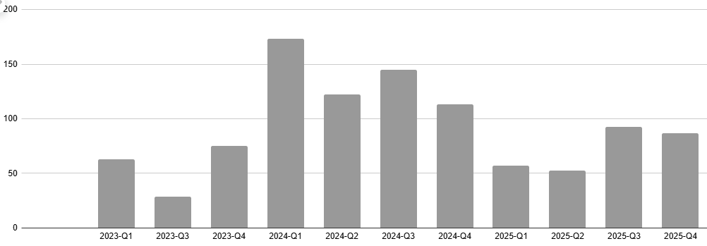

```{r setup, include=FALSE}
knitr::opts_chunk$set(echo = FALSE)
knitr::opts_chunk$set(out.width = "100%")
install.packages("tidyverse")
library(tidyverse)
library(knitr)
library(kableExtra)

timesheet <- read.csv("core_writing_data.csv")
timesheet$date <- as.Date(timesheet$Day, format = "%m/%d/%Y")
timesheet_complete <- timesheet %>%
  filter(!is.na(date)) %>%
  complete(date = seq(min(date), max(date), by = "day"), fill = list(Hours = 0, Time = "N/A", Category = "N/A", Project = "N/A", Sub.Project = ""))

#5 color palette
#003f5c
#58508d
#bc5090
#ff6361
#ffa600
```

<Placeholder for opening graphic>

# Summary

\<revise when analysis complete to incorporate high level summary\>

This is a personal project I created to demonstrate my analytical and technical proficiency applied to my creative writing process. My goal was to look for trends in the data and identify lead metrics that drive consistent output and provide myself with a data-driven roadmap for continued growth.

With dual degrees in Writing and Computer Science, I have always loved using data to inform my craft. What began as simple word-count tracking of my creative fiction writing, evolved in 2023 into a detailed timesheet that tracked my hours per project—a practice inspired by my software development work at Menlo Innovations.

From this data, I created visualizations to help contextualize the numbers, enriched my findings with additional data sources to expand that narrative, and created a dashboard for daily tracking of progress on experiments I am running to increase my writing output.

# Quick Links

Looking for examples of how I used a specific tool or technologies? Follow these links to jump to the relevant section or supplementary resource:

-   [**Spreadsheets**](#spreadsheets) - pivot tables, charts, and formulas

-   [**Python & Data Cleaning**](#python-and-data-cleaning) - script used to extract and clean supplemental data

-   **R** - this web page was made using R Markdown and most of the visuals were made using the ggplot2 library

-   TBD: **Tableau** - I made a live dashboard to track my core metrics

-   TBD: **Power BI** -

# Main Data Structure

My creative writing timesheet is tracked in a Google Sheets and there are five fields:

-   Day - when the writing occurred. There can be multiple entries for the same day logged against different projects (such as August 10th in the example below)

-   Hours - tracked in [15 minute increments](#why-15-minutes "for why 15 minutes") or 0.25 of an hour

-   Category - broad [categorization](#category-explanation "For more on what each category means") about the type of writing activity

-   Project - a shortened title of the story

-   Sub Project - an optional field to group specific efforts on a project

{style="border: 2px solid #595959; padding: 5px; border-radius: 4px; display: block; margin: auto;" width="500"}

Prior to this personal project, my primary way of visualizing this information and benchmarking my progress was through pivot tables and charts within the same Google Sheet. (For details, see [Spreadsheets](#spreadsheets))

# The Goal {#the-goal}

My goal for this project was to identify ways to increase my writing productivity without setting myself an unrealistic or unattainable goal. Last year, going into 2025, I had set myself the goal of writing at least an hour most days (a mode of 1 hour or higher). At the time, it seemed a safe increase to push myself towards given my success in 2024. But in execution, 2025 fell far short.

```{r 2024 histogram, fig.height=4, fig.width=12}
year_2024 <- timesheet_complete %>%
  filter(year(date) == 2024) %>%
  group_by(date) %>%
  summarise(sum_hours = sum(Hours))

year_2024$highlight <- ifelse((year_2024$sum_hours == 0.5 
                                | year_2024$sum_hours == 1.25),
                              "Highlighted", "Normal")

ggplot(year_2024, aes(x = sum_hours, fill=highlight)) +
  geom_histogram(
    binwidth = 0.25,
    boundary = 0,
    closed = "left",
    color = "#FFFFFF",
    show.legend = FALSE
    ) +
  coord_cartesian(xlim = c(0, 8)) +
  scale_fill_manual(values = c("Highlighted" = "#004c6d", "Normal" = "#7AA6C2")) +
  theme_minimal() +
  labs(
    title = "2024",
    x = "Hours written",
    y = "Number of days"
  ) +
  annotate("text",
         x = 0.5 + .125, #center of bin
         y = 52,
         label = "Mode: 0.5",
         size = 3) +
  annotate("text",
         x = 1.9, 
         y = 35,
         label = "Median: 1.25",
         hjust = "left",
         size = 3) +
  annotate("curve",
           x = 1.9 - 0.05,
           y = 35,
           xend = 1.25 +.125,
           yend = 32,
           arrow = arrow(length = unit(0.3, "cm"))) +
  annotate("text",
         x = 2.2, 
         y = 30,
         label = "Mean: 1.51",
         hjust = "left",
         size = 3) +
  annotate("curve",
           x = 2.2 - 0.05,
           y = 30,
           xend = 1.52,
           yend = 28.5,
           arrow = arrow(length = unit(0.3, "cm"))) +
  geom_segment(
    aes(x=1.51, y=-2, xend=1.51, yend=28), 
    linewidth = 0.5,
    linetype = "dashed")
```

```{r 2025 histogram, fig.height=3, fig.width=12}

year_2025 <- timesheet_complete %>%
  filter(year(date) == 2025) %>%
  group_by(date) %>%
  summarise(sum_hours = sum(Hours))

year_2025$highlight <- ifelse((year_2025$sum_hours == 0.25 
                                | year_2025$sum_hours == 0.5),
                              "Highlighted", "Normal")

ggplot(year_2025, aes(x = sum_hours, fill=highlight)) +
  geom_histogram(
    binwidth = 0.25,
    boundary = 0,
    closed = "left",
    color = "#FFFFFF",
    show.legend = FALSE
    ) +
  coord_cartesian(xlim = c(0, 8)) +
  scale_fill_manual(values = c("Highlighted" = "#004c6d", "Normal" = "#7AA6C2")) +
  theme_minimal() +
  labs(
    title = "2025",
    x = "Hours written",
    y = "Number of days"
  ) +
  annotate("text",
         x = 0.25 + .125, #center of bin
         y = 83 + 2,
         label = "Mode: 0.25",
         size = 3) +
  annotate("text",
         x = 0.5, 
         y = 62,
         label = "Median: 0.5",
         hjust = "left",
         size = 3) +
  annotate("text",
         x = 1.25, 
         y = 55,
         label = "Mean: 0.79",
         hjust = "left",
         size = 3) +
  annotate("curve",
          x = 1.25 - 0.05, 
          y = 55, 
          xend = 0.79 + .01,
          yend = 41,
          arrow = arrow(length = unit(0.3, "cm"))) +
  geom_segment(
    aes(x=0.79, y=-2, xend=0.79, yend=40), 
    linewidth=0.5,
    linetype = "dashed")
```

# Behind the Data

{style="border: 2px solid #595959; padding: 5px; border-radius: 4px; display: block; margin: auto;" width="500"}

Looking at my writing productivity per quarter for the last three years you can see that 2024 was by far my most successful period.

```{r totals table}
df <- data.frame(
  Category = c("Q1", "Q2", "Q3", "Q4"),
  y_2023 = c(63, 0, 28.5, 75),
  y_2024 = c(173.5, 122.25, 145, 113.5),
  y_2025 = c(57, 52.25, 92.5, 86.5)
)

df_with_total <- df %>%
  bind_rows(tibble(
    Category = "Total",
    y_2023 = sum(.$y_2023),
    y_2024 = sum(.$y_2024),
    y_2025 = sum(.$y_2025)
  ))

kable(df_with_total, col.names = c("", "2023", "2024","2025")) %>%
  kable_styling(bootstrap_options = "striped", full_width = F, position = "center") %>%
  row_spec(5, bold = T, )
```

So should my 2026 goal be to repeat a 2024 level of hourly productivity? Not necessarily. There are stories behind those numbers--so first a quick overview, looking at the data at a more granular monthly cadence.

{style="border: 2px solid #595959; padding: 5px; border-radius: 4px; display: block; margin: auto;" width="680" height="240"}

**2023:**

-   [Sorceress 2nd - Jan 2023]{style="background-color:#F07B72; padding:5px"} - I finished the 2nd draft of my Sorceress project and sent out queries to literary agents for representation.

-   [1st draft attempt - Jul 2023]{style="background-color:#EA4335; padding:5px"} - I started writing a brand new story, but lost steam part way in.

-   [Raven 1st - Sep 2023]{style="background-color:#46BDC6; padding:5px"} - I decided to participate for the first time in [National Novel Writing Month](https://en.wikipedia.org/wiki/National_Novel_Writing_Month) and use the 50k words in 30 days challenge to tackle a project I had been attempting to write for many years. September and October I wrote my new outline and the opening chapters. In November, I accomplished the 50k goal, and kept going until the manuscript was finished December 9th for a total of 85k words in 80 days!

-   Dec 2023 - Sorceress 3rd: Fresh off that success, I decided to revisit my Sorceress manuscript again and attempt another round of querying.

**2024:**

-   Jan 2024 - Sorceress 4th - R&R: An agent reached out with interest in the story. She gave me some suggest changes and requested I revise and resubmit for consideration. I invested all free time I had in getting the edits in and resubmitted in under 2 months. Unfortutunately, the agent decided not to sign the project.

-   Mar 2024 - Raven 2nd: I eagerly dove into the 2nd draft of my Raven manuscript

-   Jul 2024 - Sorceress 5th: I decided to give the Sorceress project one more go, revising it further and submitted another round of queries. No bites. I decided to shelve the manuscript for now.

-   Oct 2024 - Katarin 1st: My 2nd year of NaNoWriMo, I worked on a much shorter project and managed the 50k goal in 23 days!

-   Dec 2024 - Raven 2nd: I was into the thick of the rewrite now. Not the fun and exciting clean up of the opening chapters, but the parts where I needed to address plot gaps, character motivations, and point of view.

**2025:**

-   Feb, May, and June 2025 - Paused: In order to focus on online certification, a job search, and later adjusting to a new job, I let my morning writing habit lapse.

-   Jul 2025 - Raven 2nd: I was getting back into the morning habit again, but still working on tricky spots in my manuscript

-   Oct 2025 - Katarin 2nd: Instead of a NaNoWriMo rough draft, I decided to spend November working on Katarin's 2nd draft, and kept going on it through the end of the year.

**So in summary:**

2023 I was just getting into the swing of writing regularly.

2024 writing projects were characterized by very engaging Sorceress 4th and 5th draft rewrites, the early exciting stages of my Raven 2nd draft, and a quick rough draft.

2025 was spent almost exclusively on the harder stages of the Raven 2nd draft with intermittent when I chose to pause in the first half of the year to accomodate life events. I saw a spike in my hours when I began work on the Katarin 2nd draft.

# Apples to Oranges

Given the differences, instead of taking 2024 whole sale as my model year, I want to use it as a starting point, but correct for expected differences between 2024 and my anticipated 2026.

## Category Impact

The first high-impact factor I saw was the type of writing I was doing in 2024. It is easier for me to have longer writing sessions when working on 3rd and later drafts. Much of the writing time is rereading existing chapters to validate consistency and continuity. 2nd drafts by contrast are high-intensity and I often need frequent breaks. I would compare 3rd+ drafts to a long walk and 2nd drafts to a sprint that at certain points in the project is also up hill. Below is the normalized distribution of 1st, 2nd, and 3rd+ draft writing entries illustrating the longer writing sessions.

```{r category histogram, fig.height=3, fig.width=12}


timesheet_complete %>%
  filter(Category %in% c("1st Draft", "2nd Draft", "3rd+ Draft")) %>%
  ggplot(aes(x = Hours, fill=Category)) +
  geom_histogram(
    binwidth = 0.5,
    boundary = 0,
    closed = "left",
    color = "#FFFFFF",
    aes(y = after_stat(density))
    ) +
  labs(
    title = "Writing session lengths 2023-2025",
    x = "Hours written",
    y = "Density"
  ) +
  facet_wrap(~ Category)

# timesheet_complete %>%
#   filter(Category %in% c("1st Draft", "2nd Draft", "3rd+ Draft")) %>%
#   ggplot(aes(x = date, y = Hours, color = Category)) +
#     geom_point(alpha = .25)
```

I do not plan to work on a 3rd or later draft in 2026. To approximate this difference, I took my 2024 starting data set and replace my 3rd+ draft writing sessions with my median 2nd draft writing sessions from that year (\_\_\_\_). This created the following reduction:

<Placeholder reduction graph>

## Schedule Changes

Another complicating factor to my data set is my work schedule. In 2024 I was working Menlo Innovations and had a 4 day a week 32 hour schedule. In April 2025, I switched to a 5 day schedule at Quantum Signal AI.

\<no facet version?\>

My daily writing hours are also so variable, that I wanted to better understand which spikes were tied to high output vacation days. Scheduling a few writing-focused vacation days over the year could be a way to boost overall writing output. After enriching my timesheet data with information about my work schedule, the pattern was quickly apparent. (For more on how I sourced and cleaned my schedule data set from my old Menlo timesheets, see [**Python & Data Cleaning**](#python-and-data-cleaning).)

\<facet wrap distribution

To approximate my 4 day to 5 day shift, replaced one weekend day a week with the median weekday writing sessions length for that year (\_\_\_\_). Which furthered the reduction.

\<todo: what about vacation spikes

## Model Year Review

<look at the resulting stats I could target> <what those numbers might look like>

## What ifs

<toggle on/off adjustments> -I had written the minimum .25 all days -Or if I raised that minimum to .5 -I had extra dedicated writing day a week (moderate 1-2 hr) -I had an extra highly dedicated writing day a month (4 hrs)

## The Plan:

# Appendix

------------------------------------------------------------------------

## Spreadsheets {#spreadsheets}

### Google Sheets vs Microsoft Excel

I have regularly used both Sheets and Excel for work and personal projects, but chose to use Google Sheets for tracking my creative writing time because I already do all my creative writing in Google Docs. I like to do my writing from across multiple devices, which at various points has meant a linux computer, a Chromebook laptop, and an Android Phone. This naturally led me towards Google's tools over Microsoft's.

### Shared Writing Metrics

You can view a subset of writing timesheet data [here](https://docs.google.com/spreadsheets/d/1N7T_HbgdGJGohsjXLYBfF8_POvJ1bwDPgBQJ9C8o-Us/edit?usp=sharing) along with the formulas and aggregations I use to track my time. To see which fields are populated through formulas you can use the shortcut `` ctrl + ` `` or the menu options `View > Show > Formulas` to toggle on formula view.

A high level overview of some of the spreadsheet features I am using in this spreadsheet are:

**Formulas:**

-   **Importrange** - I chose to split the data I wanted to publicly share as part of this project from some of the more detailed and project-specific data I track in my timesheet--such as extra notes, word count, pages into a rewrite, and less-polished charts. I still wanted the shared sheet to include live data, rather than a snapshot, so I am importing the core metrics from my live spreadsheet into this shared document.

-   **Countif**, **if, or, today** - On the "Skip Days" tab of the sheet, I am generating a full list of dates starting in 2023 to today and creating fill value rows for days I did not write.

-   **Sort, vstack, filter -** To join the core writing day in with the skip days in the "Skip Days Added" tab, I am using **vstack**. I use **filter** to remove the blank space rows generated by formulas in my core data set, and I use another **filter** to only stack in those days that are skipped days. Lastly, for easier readability, I **sort** everything in ascending order.

-   **Weekday -** I like to track my writing week from Monday to Sunday so that a single weekend's effort falls in the same week. I use the **weekday** formula and **if** to calculate the Sunday week ending date.

-   **Xlookup -** I wanted to give an honorable mention to my favorite spreadsheet formula, even though it does not appear in my shared document. Introduced to Excel in 2019 and Sheets in 2022, this upgrade to **vlookup** is super powerful and I've used it often. I used **vlookup** heavily in my publishing job to aggregate error report data by book ISBN and often use **xlookup** for similar tasks where I want to match up two data sets. For this project, my creative writing data does not have a single unique key I could use for lookups. Because there can be multiple entries per date and if I had **xlookup** instead of **vstack** to join in my writing data with skip days, I would have lost entries that were on the same day.

**Pivot Tables:**

-   The tabs "Monthly Totals", "Weekly Totals", and "Daily Writing" each contain pivot tables aggregating the data using date groups at a monthly, weekly, and daily level

-   For "Monthly Totals" I also used grouped columns to combine my smaller projects to reduce clutter for the chart of monthly writing hours by prioject.

**Charts:**

-   **Stacked bar** - Are my go-to for showing the aggregate total hours worked in a time period, while also distinguishing the different categories or projects worked on.

-   **Scatter plot** - for "Daily Totals" I used scatter to show my daily writing because of the density and high variability of the data.

-   **Histograms** - These are less-polished version of the histograms appearing [earlier](#the-goal).

-   **Combo Chart** - like xlookup, I do not have an example in the shared document, but this is another of my go-tos. For rewrite projects, I track how many pages in I am on a given day. This allows me to better visualize when I have to double back to earlier in the manuscript. I include hours written on a second access because I like seeing how the two relate to one another. Sometimes my "pages in" barely moves when I am hard at work on a difficult scene, but I can see that I was still putting in a lot of time. Below is a screenshot of what this looks like for the Raven project. In it you can see that I frequently had to double back around the 80 page mark to ensure I had the right setup for a particularly difficult scene.

{style="border: 2px solid #595959; padding: 5px; border-radius: 4px; display: block; margin: auto;" width="500"}

------------------------------------------------------------------------

## Why 15 minutes? {#why-15-minutes}

Gathering metrics comes with a trade-off: the data entry must be easy enough to maintain, yet detailed enough to be meaningful. I chose 15 minutes in part due to my work at Menlo Innovations, where I was already practiced in tracking my time by the quarter-hour.

Interestingly, this increment also serves as a great motivator. If I am five minutes into a new quarter-hour, I’m more likely to keep writing to hit the next increment. If I’ve written for 20 minutes, I might as well push for 30.

------------------------------------------------------------------------

## Category explanation {#category-explanation}

For my timesheet, I define my categories this way:

-   1st draft - Writing the initial first draft of a story

-   2nd draft - Following the first draft, all the work needed to revise it into complete, coherent, and readable state.

-   3rd+ draft - Includes 3rd and later drafts. Usually just polish or adjustments to further improve the story

-   Free write - Catch-all category for activities like writing loose scenes for side projects, doing writing exercises, or brainstorming future projects. If a story later progresses to a full 1st draft, some free write entries might get recategorized into the 1st draft category

-   Querying - Time spent preparing material to query literary agents, researching agents, and any admin or meetings that result

------------------------------------------------------------------------

## Python & Data Cleaning {#python-and-data-cleaning}

To better understand my writing habits, I wanted to add additional context about my work schedule. Were the spikes in writing productivity due to a vacation day spent writing? Were drops in productivity tied to sick days or a heavy workload?

### Data Source

For my work schedule from April 2025 forward, I could easily source this information from my employer's PTO application. I also usually include a memo line on the request distinguishing between sick days and vacation time. For those few entries missing that data, they were recent enough that I knew what category to put them in. Holidays I could pull from an informational email listing the effective holidays for the year.

For data prior April 2025, I would have to get more creative. Outs were submitted through email from an account I no longer have access to, but I do have a nearly complete copy of all my Menlo timesheets from the 2023-2025 period of interest. These timesheets do not specify which days were sick days versus planned vacation outs, but they would allow me to assemble a list days I took PTO and effective holidays.

### Timesheet structure

My Menlo timesheets are structure for human readability, not an automated import. Below is an example timesheet with the data I want to pull out marked.

{style="border: 2px solid #595959; padding: 5px; border-radius: 4px; display: block; margin: auto;" width="600"}

Given the complexity of file format and the number of files (118 in total), I chose to write a python script to extract the information I needed into an easier csv format. My script needed to dynamically handle the varying number of rows and a changing layout. (During development, I found some variation in which cells were merged on the template over time). My entire python script can be found [here](https://github.com/snball6/creative-writing-metrics/blob/main/python-timesheet-parsing/timesheet_parser.py), but the parsing specifically occurs in the `parse_timesheets` function.

For the example above, my script would mark Saturday, Sunday, and Friday as weekends. Monday and Tuesday and workdays. Wednesday as PTO, and Thursday as a Holiday.

### Cleaning

After I initially parsed the data, I created a quick calendar heatmap visualization to help me validate the output. It quickly revealed some potential issues in the data. For example, it looked like I had taken three weeks of vacation in April 2024! And I saw other blank weeks that did not appear to line up with any vacations I remembered taking.


I added an additional check to my script to not only list any files that failed to parse, but to also check for any missing dates in the data. The results gave me a clear list of files to manually check, and an answer to why the missing weeks were not in my failed to parse list. The timesheets for those weeks had the right date in their file name, but the wrong one in their cells, resulting in those date's values being overwritten.

Because I wanted to be able to reproduce my work, I kept a running list of all my changes to files–checked into the same repo as my parsing script and this report. I was also working on a duplicate copy of my timesheet files, so I would always have the originals available for reference or to revert my changes.

One file I knew was missing before I even started my analysis. I decided to make a placeholder best-guess timesheet to bridge that gap. Because my goal for using this data was to identify non-work days that might explain outlier writing hours, and I had already verified there were no unusually high or low writing hours that week, I decided it was sufficient to assume a regular work week schedule. 

If I had found that there was outlier data in that week or I had more missing weeks in the data set, I would have introduced an "unknown" category to help distinguish these days.

### Additional Validation
